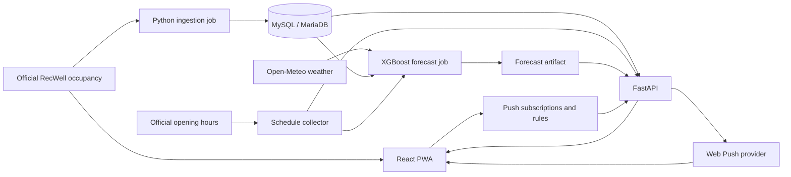

# RecLive

**Train smarter. Skip the crowd.**

RecLive helps UW–Madison students decide when to visit the Nicholas Recreation Center (Nick) and Bakke Recreation & Wellbeing Center. Check current crowd levels, explore floor maps, find quieter forecast windows, and get a one-time alert when an area drops below your chosen threshold.

[Open RecLive](https://reclive.netlify.app) · [Nick](https://reclive.netlify.app/nick) · [Bakke](https://reclive.netlify.app/bakke)

## What it does

- Live occupancy by building and gym area, with floor-map heatmaps.
- Seven-day crowd forecasts, quieter visit windows, and official opening hours.
- One-time Web Push alerts with expiry and cancellation.
- A responsive, installable Progressive Web App with an offline app shell.
- Freshness and coverage checks: missing readings stay unavailable instead of becoming zero.

RecLive depends on the official RecWell measurements and schedules. Forecasts are estimates, and cached readings have a limited lifetime. Offline installation does not provide new live data.

## Technologies

| Layer | Technologies | How RecLive uses them |
| --- | --- | --- |
| App | React 19, TypeScript, React Router 7 | Dashboard components, typed state, and `/nick` and `/bakke` routes. |
| Design | Material UI 7, MUI icons, Emotion, Roboto, Framer Motion | Responsive layouts, themes, accessible controls, typography, and motion. |
| Data client | Axios, Zod | API requests, response validation, cancellation, and safe fallback between live sources. |
| Build and PWA | Vite 7, vite-plugin-pwa, Workbox, Web App Manifest | Production bundles, a custom service worker, app-shell caching, installation, and update prompts. |
| Visualizations | SVG and TypeScript | Interactive floor-map overlays and crowd forecast charts. |
| API | Python, FastAPI, Uvicorn | HTTP endpoints for occupancy, forecasts, schedules, health, and push subscriptions. |
| Database | MySQL 8.0/8.4 or MariaDB 10.11, PyMySQL | Current snapshots, historical counts, ingestion records, alert rules, and rate limits. Versioned SQL migrations manage the schema. |
| Collection | Requests, Beautiful Soup | Occupancy-feed ingestion and parsing official RecWell opening hours. |
| Forecasting | NumPy, XGBoost, pytz, Open-Meteo | Historical and calendar features, weather inputs, model training, calibrated forecasts, and timezone handling. |
| Notifications | Push API, Notifications API, pywebpush, VAPID | Browser subscriptions and one-time server-triggered crowd alerts. |
| Configuration | python-dotenv, Vite environment variables | Local backend settings and two explicitly public frontend URLs. |
| Quality | ESLint, TypeScript, Ruff, Vitest, Testing Library, MSW, pytest, HTTPX, freezegun | Static checks, component tests, mocked API behavior, backend and time-dependent tests. |
| Browser testing | Playwright, axe-core, vitest-axe, jsdom | Route, interaction, PWA, and accessibility checks. |
| Automation | GitHub Actions, Dependabot, Gitleaks, npm audit | Frontend checks, MySQL/MariaDB integration tests, dependency review, updates, and secret scanning. |
| Hosting | Netlify and Synology | Netlify serves the frontend; the Python API runs on a privately managed Synology host. |

Dependency versions are recorded in [`package-lock.json`](package-lock.json) and [`server/requirements.txt`](server/requirements.txt); backend test tools are in [`server/requirements-dev.txt`](server/requirements-dev.txt).

## How it works



1. **Collect:** the ingestion job validates and deduplicates official measurements, saves the latest snapshots, and records history. A separate collector refreshes Nick and Bakke schedules.
2. **Forecast:** the forecast job combines historical occupancy, calendar patterns, opening hours, and weather, then writes a forecast artifact. FastAPI serves that artifact without training a model during a page request.
3. **Display:** the browser tries the public RecWell widget feed first, then the API snapshots and recent browser cache. A usable source needs fresh coverage of at least 80% of open capacity, or confirmation that every configured area is closed. Backup readings expire after ten minutes.
4. **Refresh:** visibility-aware polling and reconnect events refresh the dashboard. Missing optional sections are hidden; unavailable occupancy gets a simple retry screen.
5. **Notify:** the backend stores alert rules and evaluates them against occupancy. A committed claim prevents repeated provider attempts; provider acceptance and device delivery are separate outcomes.

See [architecture and configuration boundaries](docs/architecture.md), [forecasting and metric definitions](docs/forecasting.md), and the [operator runbook](docs/operations/runbook.md).

## Run locally

Use Node.js 22, Python 3.12, and a dedicated local MySQL 8.0/8.4 or MariaDB 10.11 database. Run commands from the repository root.

```bash
git clone https://github.com/ant0n-grachev/RecLive.git
cd RecLive
npm ci
python3.12 -m venv .venv
source .venv/bin/activate
python -m pip install -r server/requirements.txt -r server/requirements-dev.txt
cp -n .env.example .env
```

Fill in `.env` with local database settings and your backend integration configuration. For separate local frontend and API processes, use:

```dotenv
VITE_API_BASE_URL=http://127.0.0.1:8000
VITE_SITE_URL=http://127.0.0.1:5173
FORECAST_API_ALLOW_ORIGINS=http://127.0.0.1:5173
APP_ENV=development
PUSH_EVALUATOR_ENABLED=false
```

`VITE_API_BASE_URL` is an origin or deployment prefix **without an `/api` suffix**. Only it and `VITE_SITE_URL` belong in the public frontend build. `LIVE_COUNTS_URL`, database credentials, VAPID settings, and push secrets are backend-only. See [`.env.example`](.env.example) for the available settings.

For a new, empty local database, initialize the schema and start the API:

```bash
source .venv/bin/activate
python server/migrate.py
uvicorn server.forecast_api:app --host 127.0.0.1 --port 8000 --reload
```

Existing databases require the [migration and coordinated cutover procedure](docs/operations/database.md), including a verified backup. Do not point local setup commands at production.

In a second terminal, from `RecLive/`:

```bash
npm run dev -- --host 127.0.0.1 --port 5173
```

Open [the local dashboard](http://127.0.0.1:5173/nick) and [API documentation](http://127.0.0.1:8000/docs). To populate your local database and artifacts after configuring the sources:

```bash
source .venv/bin/activate
python server/facility_hours_fetch.py
python server/gym_fetch.py
python server/forecast_job.py
```

These jobs fetch real upstream data and write local state. Forecasts need historical observations; a new database will not immediately have useful predictions. Enable push only after configuring VAPID and endpoint-hash settings; deployed Web Push requires HTTPS and browser permission.

## Deploy

The frontend is hosted at [reclive.netlify.app](https://reclive.netlify.app), backed by FastAPI on a Synology host. Netlify is connected to `main`, uses `npm run build`, and publishes `dist/`.

1. Run the checks below and record the source commit and actual results.
2. Configure **only** `VITE_API_BASE_URL` and `VITE_SITE_URL` on the frontend host, using the production API and site URLs. Run `npm ci` and `npm run build`. Publish only `dist/`; its `_redirects` file provides SPA fallback for both facility routes.
3. Install the Python runtime requirements on the backend host. Supply private configuration through its process manager, set `APP_ENV=production`, and allow the exact frontend HTTPS origin in CORS.
4. Follow the [database migration procedure](docs/operations/database.md) before starting code that needs a schema change. Keep database contents, keys, model files, and generated forecast artifacts outside the frontend deployment.
5. Start the API with `uvicorn server.forecast_api:app --host 127.0.0.1 --port 8000` behind an HTTPS reverse proxy. Register one scheduler per job: ingestion at least every 90 seconds, forecasts every 15 minutes, and schedules every four hours. These are recommended cadences; the commands do not install schedulers.
6. Check `/health` on the backend and its public URL, then open `/nick` and `/bakke` in a browser. A successful upload alone does not verify a release.

Use the existing Synology service and scheduler configuration when updating an established installation; do not add duplicate jobs. The [operator runbook](docs/operations/runbook.md) covers backups, migration compatibility, push lifecycle, health interpretation, maintenance, and recovery. Keep a previous verified deployment available for rollback; application rollback does not reverse schema changes.

## Verify changes

```bash
npm run lint
env -u NODE_OPTIONS node tests/frontend/run-isolated.cjs build
env -u NODE_OPTIONS node tests/frontend/run-isolated.cjs test:run
npx playwright install chromium
env -u NODE_OPTIONS node tests/frontend/run-isolated.cjs test:e2e
source .venv/bin/activate
ruff check server tests
python -m pytest -q
npm audit --omit=dev
gitleaks git --redact --log-opts="--all"
git diff --check
```

The isolated frontend launcher uses synthetic public URLs and blocks checkout `.env` reads; its build is for verification. Production builds use the production URLs. Backend tests likewise isolate application configuration. Real database tests require a disposable database configured through `TEST_MYSQL_*`; GitHub Actions runs them against MySQL 8.4 and MariaDB 10.11. See the [full verification procedure](docs/operations/runbook.md#evidence-record), including coverage and dependency checks. Install Gitleaks separately for the history scan.

## Repository layout

```text
src/app/                 App shell, routing, theme, and refresh hooks
src/features/            Dashboard, forecasts, heatmaps, and alerts
src/facilities/          Shared facility UI and compatibility components
src/lib/                 API clients, validation, configuration, and storage
src/pwa/                 Service worker and update lifecycle
public/                  Floor maps, icons, manifest, and Netlify redirects
shared/                  Facility capacity definitions
server/reclive/          API, ingestion, forecasting, database, and push services
server/migrations/       Immutable versioned SQL migrations
server/*.py              Operational command and compatibility entry points
tests/                   Backend, browser, isolation tests, and fixtures
docs/                    Architecture, forecasting, and operations guides
.github/                 CI, security checks, and dependency updates
```

Completed implementation plans remain in Git history. Private configuration, generated artifacts, test output, and local recovery copies are ignored. Please use [SECURITY.md](SECURITY.md) for vulnerability reporting and handling sensitive material.

## License and credits

Licensed under [Apache 2.0](LICENSE). Built by Anton and [Alex](https://github.com/alexgabrichidze).
